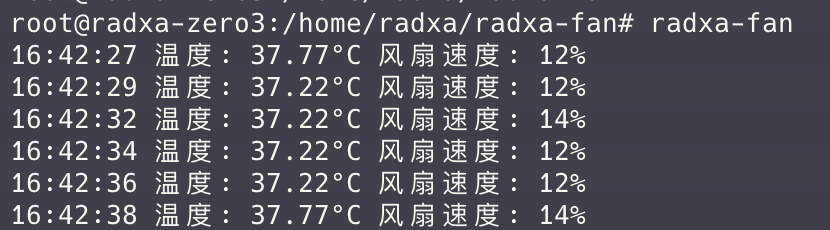
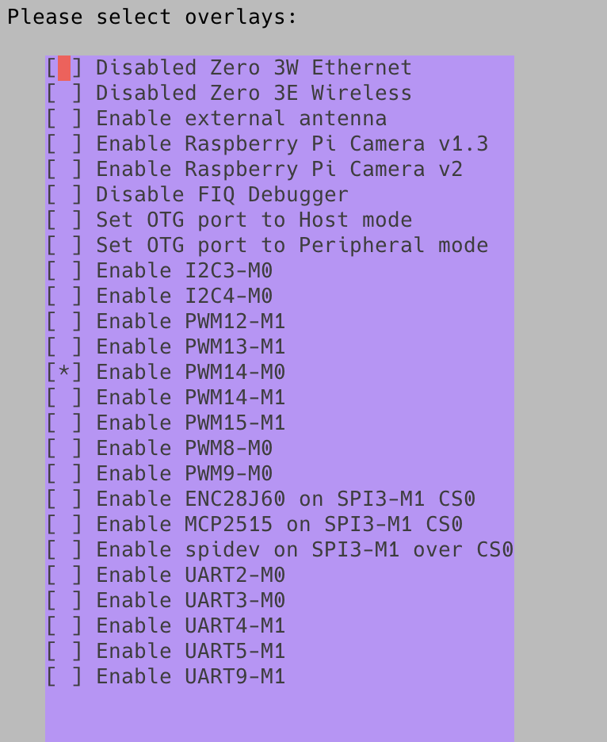
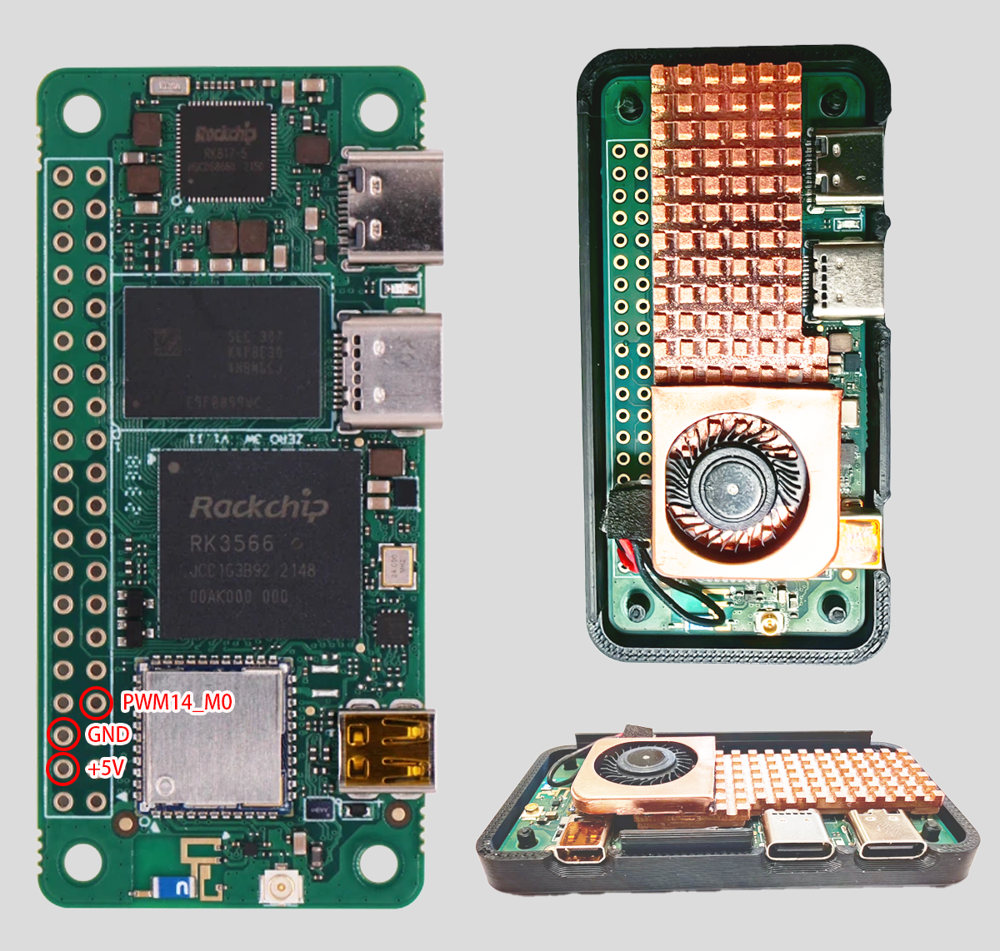

## 简单的控制radxa zero3w的风扇

#### 效果展示



#### 一、安装与配置

###### 1、系统配置

使用radxa系统中自带的rsetup进行配置overlays

参考资料:`https://docs.radxa.com/zero/zero3/os-config/rsetup`



###### 2、焊接风扇(引脚定义和成品外观)



###### 3、安装本脚本

```bash
wget https://github.com/FlashSoft/radxa-zero3w-fan/archive/refs/heads/main.zip
unzip main.zip
cd radxa-zero3w-fan-main
bash ./install.sh
```

###### 4、查看运行情况

```bash
radxa-fan
```


#### 使用

###### 启动本脚本

`systemctl start radxa-fan`

###### 实时查看当前温度和风扇速度

`radxa-fan`

###### 调整参数

`vi /usr/local/bin/radxa-fan`

```bash
# 最低温度
min_temp=35000
# 最高温度
max_temp=55000
# 最大pwm关断值
max_pwm=30000
# PWM引脚
pwm_chip="pwmchip14"
```
